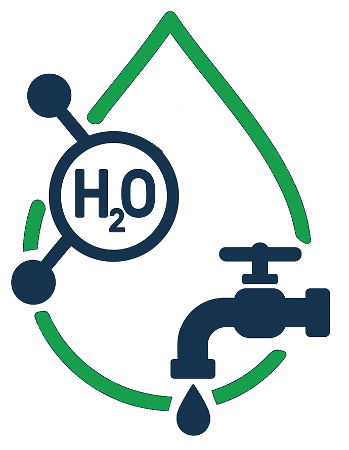
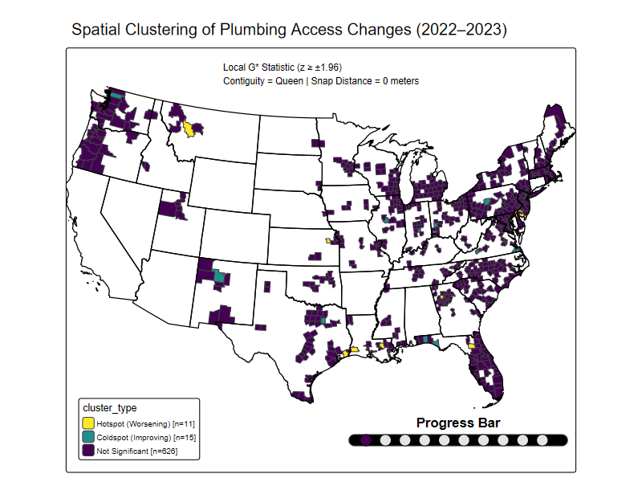

```{r}
#| label: load-packages
#| include: false

# - loading package manager
if (!require(pacman))
  install.packages(pacman)

# - loading required packages
pacman::p_load(tidyverse,
               here,
               forcats,
               scales,
               sf,
               tidycensus,
               tigris,
               patchwork,
               viridis,
               spdep,
               tmap,
               ggrepel
               )
options(readr.show_progress = FALSE)
options(readr.show_progress = FALSE)
options(tigris_progress = FALSE)
sf::sf_use_s2(FALSE)      # optional, disables spherical geometry engine, may help
options(sf.show_progress = FALSE)  # this is the key

```

```{r}
#| label: setup
#| include: false

# Plot theme
ggplot2::theme_set(ggplot2::theme_minimal(base_size = 11))

# For better figure resolution
knitr::opts_chunk$set(
  fig.retina = 3, 
  dpi = 300, 
  fig.width = 6, 
  fig.asp = 0.618 
  )

```

```{r}
#| label: load-data
#| include: false
# Load data here
# Load water insecurity data from the TidyTuesday project (2025-01-28)
# This dataset explores social vulnerability and access to complete indoor
# plumbing across U.S. counties,
# curated by Niha Pereira and featured in the blog post:
# "Mapping water insecurity in R with tidycensus"
# Original data sources include the U.S. Census Bureau (ACS) and the USGS Vizlab’s
# “Unequal Access to Water” visualization.
# Repo: 
# https://github.com/rfordatascience/tidytuesday/tree/main/data/2025/2025-01-28
suppressMessages(water_insecurity_2022 <- read_csv(here("water_insecurity",
                                       "water_insecurity_2022.csv"),progress = FALSE))
suppressMessages(water_insecurity_2023 <- read_csv(here("water_insecurity",
                                       "water_insecurity_2023.csv"),progress = FALSE))

# ---- load data here, I guess ..........
# TODO_
```

<!-- slide 0 -->

::: {.banner-container style="margin-bottom: 30px;"}
{.banner-image style="max-width: 100%; height: auto;"}
:::

```{=html}
<div style="position: relative; display: flex; align-items: flex-start; margin-top: 30px; min-height: 300px;">
  
  <!-- Left image -->
  <div style="flex-shrink: 0; margin-right: 40px;">
    
  </div>

  <!-- Right column: Text + Logo block -->
  <div style="display: flex; flex-direction: column; justify-content: space-between; height: 300px;">
    
    <!-- Text block -->
    <div style="
      font-size: 70px;
      font-weight: bold;
      font-family: Arial, sans-serif;
      text-align: left;
      line-height: 1.4;
      color: #1B9FAB;
    ">
      Plumbing the Data:<br>
      Mapping U.S. Water Insecurity

      <div style="font-size: 30px; margin-top: 20px; color: #AB0520;">
        INFO 526 — Summer 2025 — Final Project
      </div>
    </div>

    <!-- Larger Logo block -->
    <div style="
      display: flex;
      align-items: center;
      border: 1px solid black;
      border-radius: 12px;
      padding: 10px 16px;
      background-color: #fff;
      margin-top: 20px;
      width: 480px;
    ">
      
      <span style="
        font-size: 20px;
        font-family: Arial, sans-serif;
        color: #333;
      ">
        <strong>The Data Plumbers:</strong><br>  Nathan Herling & Yashi Mi
      </span>
    </div>
  </div>
</div>
```

<!--Slide 1 -->

## Our Dataset

::: cell_text_block
-   **Title**: "Water Insecurity in the U.S." (TidyTuesday, 2025-01-28)\

-   **Source**: American Community Survey (ACS), USGS Vizlab\

-   **Curated by**: Niha Pereira

-   **Focus**: Plumbing insecurity at the U.S. county level\

-   **Years covered**: 2022 and 2023\

-   **Geographic scope**: 850+ counties per year
:::

<!--Slide 2 -->

## 

```{=html}
<div style="width: 100%; display: flex; justify-content: space-between; align-items: flex-start;">
  <div style="width: 50%;">
    <h3>Data files</h3>
    <ul>
      <li><code>water_insecurity_2022.csv</code></li>
      <li><code>water_insecurity_2023.csv</code></li>
    </ul>
    <h3 style="margin-top: 20px;">Repository</h3>
    <p><code>tidytuesday/data/2025/2025-01-28</code></p>
  </div>
  <div style="width: 50%; display: flex; justify-content: flex-end;">
    
  </div>
</div>

```

<!-- slide 3 -->

## Variables Examined

```{=html}
<div style="
  display: grid;
  grid-template-columns: 1fr 1fr;
  column-gap: 60px;
  width: 95%;
  font-size: 110%;
  margin: 0;
  padding: 0;
">

  <div style="line-height: 1.3;">
    <ul style="margin: 0; padding-left: 0;">
      <li><code>geoid</code> – County FIPS code</li>
      <li><code>name</code> – County name</li>
      <li><code>year</code> – Survey year</li>
      <li><code>geometry</code> – County boundaries</li>
    </ul>
  </div>

  <div style="line-height: 1.3; padding-left: 20px;">
    <ul style="margin: 0; padding-left: 20px;">
      <li><code>total_pop</code> – Total population</li>
      <li><code>plumbing</code> – Households lacking plumbing</li>
      <li><code>percent_lacking_plumbing</code> – % without plumbing</li>
    </ul>
  </div>

</div>
```

<!--Slide 4 -->

## Project goal

::: {.custom-box style="border: 2px solid #19A6B8; border-radius: 12px; padding: 15px 20px; max-width: 900px; font-family: Arial, sans-serif; font-size: 2.75rem; line-height: 1.5; background-color: #fafafa;"}
This project analyzes county-level water insecurity in the U.S., focusing on access to complete indoor plumbing in 2022 and 2023. It aims to identify regional disparities and year-over-year trends using spatial and statistical methods. The findings will highlight areas with significant plumbing insecurity to inform efforts toward improving water access equity.
:::

<!--Slide 5 -->

## 


### Question 1

::: cell_text_block
**Top counties had the highest plumbing insecurity in 2022 and 2023?**

This analysis focuses on identifying the top counties with the highest plumbing insecurity in each year and examining the geographic distribution of these counties to understand regional patterns of indoor plumbing leakage in the United States.
:::

<!--Slide 6 -->

## 

### Question 1


[Top 10 Counties with Highest Plumbing Insecurity in 2022 and 2023]{style="font-size: 25px; margin: 0px;"}

```{r}
#| lable: question1-results1
#| echo: false
#| message: false
#| warning: false
#| fig-width: 14
#| fig-height: 3

options(cli.default_handler = function(...) invisible())
options(tigris_use_cache = TRUE)

#Top 10 dataset
Top10_2022<-water_insecurity_2022 |>
  arrange(desc(percent_lacking_plumbing))|>
  slice_head(n = 10)|>
  mutate(name = fct_reorder(name, percent_lacking_plumbing),
         percentage = case_when(percent_lacking_plumbing > 1 ~ "> 1%",
         TRUE ~ "≤ 1%"))


Top10_2023<-water_insecurity_2023 |>
  arrange(desc(percent_lacking_plumbing))|>
  slice_head(n = 10)|>
  mutate(name = fct_reorder(name, percent_lacking_plumbing),
         percentage = case_when(percent_lacking_plumbing > 1 ~ "> 1%",
         TRUE ~ "≤ 1%"))

#Bar graph
plot_2022_bar <- ggplot(Top10_2022, aes(y=name, x=percent_lacking_plumbing, fill = percentage))+
  geom_col()+
  scale_fill_manual(
    values = c("> 1%" = "#E76F51", "≤ 1%" = "#2A9D8F"))+
  labs(
    title = "Top 10 U.S. Counties with Highest \nPlumbing Insecurity (2022)",
    x = "Lacking Plumbing",
    y = ""
  ) +
  scale_x_continuous(labels = label_percent(scale = 1))+
  theme_minimal()+
   theme(panel.grid = element_blank())

plot_2023_bar <-ggplot(Top10_2023, aes(y=name, x=percent_lacking_plumbing, fill = percentage))+
  geom_col()+
  scale_fill_manual(
    values = c("> 1%" = "#E76F51", "≤ 1%" = "#2A9D8F"))+
  labs(
    title = "Top 10 U.S. Counties with Highest \nPlumbing Insecurity (2023)",
    x = "Lacking Plumbing",
    y = ""
  ) +
  scale_x_continuous(labels = label_percent(scale = 1))+
  theme_minimal()+
   theme(panel.grid = element_blank())

(plot_2022_bar | plot_2023_bar) + plot_layout(widths = c(1,1))


```

<!--Slide 7 -->

## 

### Question 1

[Top 10 Counties with Highest Plumbing Insecurity in 2022 and 2023]{style="font-size: 25px; margin: 0px;"}

::: full-plot-container
```{r}
#| lable: question1-results2
#| echo: false
#| message: false
#| warning: false
#| fig-width: 10
#| fig-height: 16
#| out.width: "100%"
#| out.height: "auto"
#| fig-align: "center"


options(cli.default_handler = function(...) invisible())
options(tigris_use_cache = TRUE)

#Load Library county Data
counties_sf <- counties(cb = TRUE, year = 2022, class = "sf")
counties_top10_2022 <- counties_sf |>
  left_join(Top10_2022, by = c("GEOID" = "geoid"))

counties_top10_2023 <- counties_sf |>
  left_join(Top10_2023, by = c("GEOID" = "geoid"))

#Map
plot_2022_map <-ggplot() +
  geom_sf(data = counties_sf, fill = "grey90", color = "white") +   
  geom_sf(data = counties_top10_2022, aes(fill = percentage), color = NA) + 
  scale_fill_manual(
    values = c("> 1%" = "#E76F51", "≤ 1%" = "#2A9D8F"),na.value = NA,) + labs(
    title = "Top 10 U.S. Counties with Highest \nPlumbing Insecurity (2022)")+
  coord_sf(xlim = c(-180, -60), ylim = c(15, 72)) + 
  theme_minimal()

plot_2023_map <-ggplot() +
  geom_sf(data = counties_sf, fill = "grey90", color = "white") +   
  geom_sf(data = counties_top10_2023, aes(fill = percentage), color = NA) + 
  scale_fill_manual(
    values = c("> 1%" = "#E76F51", "≤ 1%" = "#2A9D8F"),na.value = NA,) +labs(
    title = "Top 10 U.S. Counties with Highest \nPlumbing Insecurity (2022)")+
  coord_sf(xlim = c(-180, -60), ylim = c(15, 72)) + 
  theme_minimal()
plot_2022_map | plot_2023_map
```
:::

<!--Slide 8 -->

## 

### Question 2

::: cell_text_block
**Top U.S. Counties in Hotspot and Coldspot Clusters of Plumbing Insecurity (2022–2023)?** <br> This analysis focuses on measuring year-over-year changes in plumbing insecurity across U.S. counties and identifying spatial clusters of significant improvement or decline, in order to understand where regional shifts in plumbing access are occurring and whether those shifts follow meaningful geographic patterns.
:::

<!--Slide 9 -->

## 

### Question 2
```{=html}
<div style="font-size: 24px; line-height: 1.4;">

  <h2>Hyperparameter Overview</h2>

  <dl>
    <dt><strong>1. Spatial Contiguity Type (<code>queen_setting</code>)</strong></dt>
    <dd>
      Determines how neighboring counties are defined.<br>
      <strong>Queen contiguity</strong> (<code>TRUE</code>) considers counties neighbors if they share an edge <em>or</em> a corner.<br>
      <strong>Rook contiguity</strong> (<code>FALSE</code>) considers counties neighbors only if they share an edge.<br>
      Queen contiguity captures more spatial relationships compared to Rook contiguity.
    </dd>

    <dt><strong>2. Snap Distance (<code>snap_distance</code>)</strong></dt>
    <dd>
      Distance threshold (20,000 meters) used to “snap” county boundaries close enough to be considered neighbors.<br>
      Helps address gaps or small separations in spatial boundaries for more robust neighbor definitions.
    </dd>

    <dt><strong>3. Z-Score Threshold (<code>z_threshold</code>)</strong></dt>
    <dd>
      Statistical cutoff (±1.96) for identifying significant spatial clusters.<br>
      Corresponds to a 95% confidence level (p ≤ 0.05).<br>
      Counties with Local G* statistic z-scores beyond this threshold are classified as <strong>hotspots</strong> (worsening) or <strong>coldspots</strong> (improving).
    </dd>
  </dl>

</div>

```
<!--Slide 10-->
##
```{r}
# Load hyperparameter sweep results
results_tbl <- read_csv(here("_extra", "hyper_param_sweep.csv"), show_col_types = FALSE)

# ────────────────────────────────────────────────
# Shared plot theme
base_theme <- theme_minimal(base_size = 13)

# ────────────────────────────────────────────────
# Set cutoff for significance
z_cutoff <- 1.96

# ────────────────────────────────────────────────
# Define shading colors from viridis turbo palette
shade_hot_color <- viridis(10, option = "turbo")[7]  # bright yellow-ish
shade_cold_color <- viridis(10, option = "turbo")[4] # teal-ish

# ────────────────────────────────────────────────
# Hotspot plot (positive z)
p_hotspot <- ggplot(
  results_tbl %>% filter(!is.na(`Hotspot (Worsening)`)),
  aes(x = z, y = `Hotspot (Worsening)`, color = factor(snap))
) +
  # Shade right of cutoff line (zone of significance)
  annotate(
    "rect",
    xmin = z_cutoff, xmax = Inf,
    ymin = -Inf, ymax = Inf,
    fill = shade_hot_color,
    alpha = 0.7
  ) +
  geom_line(linewidth = 0.5) +
  facet_wrap(~ queen, labeller = label_both) +
  geom_vline(xintercept = z_cutoff, linetype = "dashed", color = "red") +
  # Repel annotation for vertical line
  geom_text_repel(
    data = tibble(
      x = z_cutoff,
      y = max(results_tbl$`Hotspot (Worsening)`, na.rm = TRUE) * 0.3,
      label = paste0("z = ", z_cutoff)
    ),
    aes(x = x, y = y, label = label),
    color = "black",
    nudge_x = -0.32,
    nudge_y = -0.4 * max(results_tbl$`Hotspot (Worsening)`, na.rm = TRUE),
    direction = "y",
    hjust = 1,
    segment.size = 0.3,
    segment.color = "grey50",
    size = 2
  ) +
  annotate(
    "text",
    x = z_cutoff + 0.2,
    y = max(results_tbl$`Hotspot (Worsening)`, na.rm = TRUE) * 0.8,
    label = "Statistical Significance\nHotspots (p ≤ 0.05)",
    color = "black",
    hjust = 0.2,
    size = 2
  ) +
  labs(
    title = "Hotspot Counts vs Positive Z-Threshold",
    x = "Z-Threshold",
    y = "Hotspot Count",
    color = "Snap Distance"
  ) +
  base_theme +
theme(
  panel.spacing.x = unit(1.5, "lines"),
  strip.text = element_text(size = 8, face = "bold"),   # column facet titles
  strip.text.y = element_text(size = 10),                # row facet titles like "Hotspot Count"
  axis.title.y = element_text(size = 9),                # << controls "Hotspot Count" size
  axis.title.x = element_text(size = 10),
  plot.title = element_text(hjust = 0.5),
  axis.text.x = element_text(size = 8, angle = 45, hjust = 1),
  axis.text.y = element_text(size = 8),                  # y-axis labels
  legend.text = element_text(size = 8),                  # legend text size
  legend.title = element_text(size = 9),                 # legend title size (optional)
  legend.spacing.y = unit(0.1, "cm"),                    # vertical space between legend items
  legend.key.size = unit(0.3, "cm")                      # size of legend key boxes
)

# ────────────────────────────────────────────────
# Coldspot plot (negative z)
coldspot_data <- results_tbl %>%
  filter(!is.na(`Coldspot (Improving)`)) %>%
  mutate(z_neg = -z)

p_coldspot <- ggplot(
  coldspot_data,
  aes(x = z_neg, y = `Coldspot (Improving)`, color = factor(snap))
) +
  # Shade left of cutoff line (zone of significance)
  annotate(
    "rect",
    xmin = -Inf, xmax = -z_cutoff,
    ymin = -Inf, ymax = Inf,
    fill = shade_cold_color,
    alpha = 0.7
  ) +
  geom_line(linewidth = 0.5) +
  facet_wrap(~ queen, labeller = label_both) +
  geom_vline(xintercept = -z_cutoff, linetype = "dashed", color = "red") +
  # Repel annotation for vertical line
  geom_text_repel(
    data = tibble(
      x = -z_cutoff,
      y = max(coldspot_data$`Coldspot (Improving)`, na.rm = TRUE) * 0.3,
      label = paste0("z = -", z_cutoff)
    ),
    aes(x = x, y = y, label = label),
    color = "black",
    nudge_x = 0.3,
    nudge_y = -0.5 * max(coldspot_data$`Coldspot (Improving)`, na.rm = TRUE),
    direction = "y",
    hjust = 0,
    segment.size = 0.3,
    segment.color = "grey50",
    size = 2
  ) +
  annotate(
    "text",
    x = -z_cutoff - 0.2,
    y = max(coldspot_data$`Coldspot (Improving)`, na.rm = TRUE) * 0.85,
    label = "Statistical Significance\nColdspots (p ≤ 0.05)",
    color = "black",
    hjust = 0.9,
    size = 2
  ) +
  labs(
    title = "Coldspot Counts vs Negative Z-Threshold",
    x = "Z-Threshold (Negative for Coldspots)",
    y = "Coldspot Count",
    color = "Snap Distance"
  ) +
  base_theme +
  theme(
  panel.spacing.x = unit(1.5, "lines"),
  strip.text = element_text(size = 8, face = "bold"),   # column facet titles
  strip.text.y = element_text(size = 10),                # row facet titles like "Hotspot Count"
  axis.title.y = element_text(size = 9),                # << controls "Hotspot Count" size
  axis.title.x = element_text(size = 10),
  plot.title = element_text(hjust = 0.5),
  axis.text.x = element_text(size = 8, angle = 45, hjust = 1),
  axis.text.y = element_text(size = 8),                  # y-axis labels
  legend.text = element_text(size = 8),                  # legend text size
  legend.title = element_text(size = 9),                 # legend title size (optional)
  legend.spacing.y = unit(0.1, "cm"),                    # vertical space between legend items
  legend.key.size = unit(0.3, "cm")                      # size of legend key boxes
  )
# ────────────────────────────────────────────────
# Combine plots vertically with equal heights
combined_plot <- p_hotspot / p_coldspot + plot_layout(heights = c(1, 1))

# ────────────────────────────────────────────────
# Save and print
ggsave(
  filename = here("_extra", "topo_lines_hotspot_coldspot_shaded_annotated.png"),
  plot = combined_plot,
  width = 8,
  height = 10
)

print(combined_plot)

```
<!--Slide 11 -->
##
### Animation graph
<!--
::: {#snap-distance style="padding: 6px; background-color: #f4f4f4; border-left: 4px solid #007acc; font-family: Arial, sans-serif; font-size: 24px;"}
<strong>Sweeping through the hyperparameter</strong>: <br>
<em>“Snap Distance”</em><br>
From <strong>0</strong> to <strong>20,000</strong> [m]
:::
-->
<div style="max-width: 800px; margin: 0 auto;">
  
</div>

<!--Slide 11 -->
## 

### Summary 1

<!--Slide 12 -->
##
### Summary 2

::: cell_text_block
-   Arizona and New Mexico counties consistently rank highest in plumbing insecurity, with Apache, McKinley, and Navajo counties showing persistent access challenges.

-   Alaska counties like Fairbanks North Star and Matanuska-Susitna also face notable plumbing insecurity, highlighting infrastructural inequities in remote regions.
:::

<!--Slide 11 -->
## 

::: {.banner-container style="margin-bottom: 10px;"}
{.banner-image style="max-width: 100%; height: auto;"}
:::

### Thank You!

-   We appreciate your attention.
-   Questions or feedback are welcome.

**Team Members:**

```{=html}
<!-- Container for full-width layout with left and right content -->
<div style="
  display: flex;
  justify-content: space-between;
  align-items: flex-start;
  width: 100%;
  padding: 12px;
">

  <!-- Left side: Team info box -->
  <div style="
    width: 480px;
    padding: 12px;
    border: 1px solid #ccc;
    border-radius: 8px;
    background-color: #f9f9f9;
    display: flex;
    align-items: center;
  ">
    
    <div style="font-family: Arial, sans-serif; color: #333;">
      <div style="font-size: 30px; font-weight: bold;">The Data Plumbers:</div>
      <div style="font-size: 24px;">Nathan Herling &amp; Yashi Mi</div>
    </div>
  </div>

  <!-- Right side: Rolling sphere GIF -->
  <!-- Right side: Offset Rolling Sphere GIF -->
  <div style="transform: translate(10px, -350px);">
    
  </div>
</div>
```

